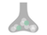

# Index of GitHub Repositories

Here you can explore GitHub repositories associated with SyNergy projects, and links to their related publications.

_For more information on our research and publications, visit [the SyNergy website](https://synergy-munich.de/)._

 

  

    <h2>&#9654; Transcriptomics Projects</h2>
  

  

  <h3>Adult neural stem cell activation in mice is regulated by the day/night cycle and intracellular calcium dynamics</h3>
  

    
  

  

  <ul>
    <li>
      <a href="https://github.com/SaghatelyanLab/Calcium_analysis_in_NSC">Code for analysis of Ca2+ activity in neural stem cells</a>
    </li>
  </ul> 
  

  

  <h3>CD8+ T cells induce interferon-responsive oligodendrocytes and microglia in white matter aging</h3>
  

    
  

  

  <ul>
    <li>
      <a href="https://github.com/ISD-SystemsNeuroscience/Aging_Oligos_Microglia">Transcriptomics characterization of oligodendrocytes and microglia in white matter aging</a>
    </li>
  </ul>
  

  

  <h3>Parkinson's disease motor symptoms rescue by CRISPRa‐reprogramming astrocytes into GABAergic neurons</h3>
  

    
  

  

  <ul>
    <li>
      <a href="https://github.com/theislab/astrocytes_reprogramming_analysis">Astrocytes reprogramming analysis</a>
    </li>
  </ul>
  

  

  <h3>Phagocyte-mediated synapse removal in cortical neuroinflammation is promoted by local calcium accumulation</h3>
  

    
  

  

  <ul>
    <li>
      <ul>
        <li>
          <a href="https://github.com/portugueslab/Jafari-et-al-2020">Code and sample data used for parts of the analysis in the paper Jafari et al., 2020</a>
        </li>
        <li>
          <a href="https://github.com/engelsdaniel/schirmer_reanalyzed">Re-analysis of snRNA-seq data from Schirmer et al., Nature, 2019</a>
        </li>
      </ul>
    </li>
  </ul>
  

  

  <h3>Shared inflammatory glial cell signature after stab wound injury</h3>
  

    
  

  

  <ul>
    <li>
      <ul>
        <li>
          <a href="https://github.com/NinkovicLab/Koupourtidou-Schwarz-et-al">Analysis pipeline for scRNA-seq/stRNA-seq</a>
        </li>
        <li>
          <a href="https://github.com/isdneuroimaging/mmqt">Microglia morphology quantification tool (MMQT)</a>
        </li>
        <li>
          <a href="https://github.com/simonmfr/SPATA2/tree/publicationCK">Spatial gradient analysis</a>
        </li>
      </ul>
    </li>
  </ul>
  

  

  <h3>Spatial Transcriptomics-correlated Electron Microscopy maps transcriptional and ultrastructural responses to brain injury</h3>
  

    
  

  

  <ul>
    <li>
      <a href="https://github.com/ISD-SystemsNeuroscience/STcEM">Spatial Transcriptomics-correlated Electron Microscopy analysis</a>
    </li>
  </ul>
  

  

  <h3>T cell-mediated microglial activation triggers myelin pathology in a mouse model of amyloidosis</h3>
  

    
  

  

  <ul>
    <li>
      <a href="https://github.com/Ruoqing-feng/AD_inflammation">scRNA-seq analysis</a>
    </li>
  </ul>
  

  

  <h3>T cells modulate the microglial response to brain ischemia</h3>
  

    
  

  

  <ul>
    <li>
      <a href="https://github.com/Lieszlab/Benakis-et-al.-2022-eLife">scRNA-seq analysis</a>
    </li>
  </ul>
  

---

  

    <h2>&#9654; Proteomics Projects</h2>
  

  
  

  <h3>Defining the Adult Neural Stem Cell Niche Proteome Identifies Key Regulators of Adult Neurogenesis</h3>
  

    
  

  <ul>
    <li>
      <a href="https://github.com/FranzeLab">MATLAB scripts to analyze AFM data</a>
    </li>
  </ul>
  

  <h3>Mapping autophagosome contents identifies interleukin-7 receptor-alpha as a key cargo modulating CD4+ T cell proliferation</h3>
  

    
  

  <ul>
    <li>
      <a href="https://github.com/dzhou93/proximity_labelling_pipeline/commit/2e825476556087ae0cff51310556adb278a83d77">Mass spectrometry data analysis</a>
    </li>
  </ul>
  

  <h3>Met/HGFR triggers detrimental reactive microglia in TBI</h3>
  

    
  

  <ul>
    <li>
      <a href="https://github.com/Rida-Rehman/PROTEAS">PROTEAS: Protein microarray expression analysis</a>
    </li>
  </ul>
  

  <h3>Proteomic and lipidomic profiling of demyelinating lesions identifies fatty acids as modulators in lesion recovery</h3>
  

    
  

  <ul>
    <li>
      <a href="https://github.com/lenkavaculciakova/lesion_volume">Code for calculating the lesion volume</a>
    </li>
  </ul>
  

  <h3>Targeting the TCA cycle can ameliorate widespread axonal energy deficiency in neuroinflammatory lesions</h3>
  

    
  

  <ul>
    <li>
      <a href="https://github.com/engelsdaniel/mitoproteomics">Python algorithm for the analysis of the EAE mitochondrial proteome</a>
    </li>
  </ul>

---

  

    <h2>&#9654; Multi-omics Projects</h2>
  

  

  <h3>Multiomic ALS signatures highlight subclusters and sex differences suggesting the MAPK pathway as therapeutic target</h3>
  

    
  

  

  <ul>
    <li>
      <a href="https://github.com/imsb-uke/MAXOMOD_Pipeline">Multi-omics analysis pipeline for the MAXOMOD project</a>
    </li>
  </ul>
  

  

---

  

    <h2>&#9654; Imaging Projects</h2>
  

  
  

  <h3>Amyloid-associated increases in soluble tau relate to tau aggregation rates and cognitive decline in early Alzheimer’s disease</h3>
  

    
  

  

  <ul>
    <li>
      <a href="https://github.com/alexapichet/NatureComms2022_tau">Sample R code from publication</a>
    </li>
  </ul>
  

  

---

  

    <h2>&#9654; Tutorials/Additional Resources</h2>
  

  
  

  <h3>Theis Lab (Helmholtz Munich)</h3>
  

    
  

   

  <ul>
    <li>
      <ul>
        <li>
          <a href="https://github.com/theislab">Theis Lab GitHub page</a>
        </li>
        <li>
          <a href="https://github.com/theislab/single-cell-tutorial">Single-cell tutorial</a>
        </li>
        <li>
          <a href="https://github.com/theislab/single-cell-best-practices">Single-cell best practices</a>
        </li>
      </ul>
    </li>
  </ul>
  

  

  <h3>MATLAB Tutorials</h3>
  

    
  

   

  <ul>
    <li>
      <ul>
        <li>
          <a href="https://github.com/csitron/MATLAB-Programs-for-Flow-Cytometry">MATLAB Programs for Flow Cytometry</a>
        </li>
        <li>
          <a href="https://github.com/csitron/Western-Blot-Quantification-in-MATLAB">Western Blot Quantification in MATLAB</a>
        </li>
      </ul>
    </li>
  </ul>
  

  

  <h3>PSMD (marker for cerebral small vessel disease)</h3>
  

    
  

   

  <ul>
    <li>
      <ul>
        <li>
          <a href="https://github.com/miac-research/psmd">PSMD (Peak width of Skeletonized Mean Diffusivity) Marker</a>
        </li>
      </ul>
    </li>
  </ul>
  

  

  <h3>Nanoscale Hub: Analysis pipelines</h3>
  

    
  

   

  <ul>
    <li>
      <ul>
        <li>
          <a href="https://github.com/georgkislinger/Crop_EM_to_bbox">Crop Electron Microscopy (EM) image to a bounding box (bbox)</a>
        </li>
        <li>
          <a href="https://github.com/georgkislinger/ImportUtility">Import Utility</a>
        </li>
      </ul>
    </li>
  </ul>
  

  

  

